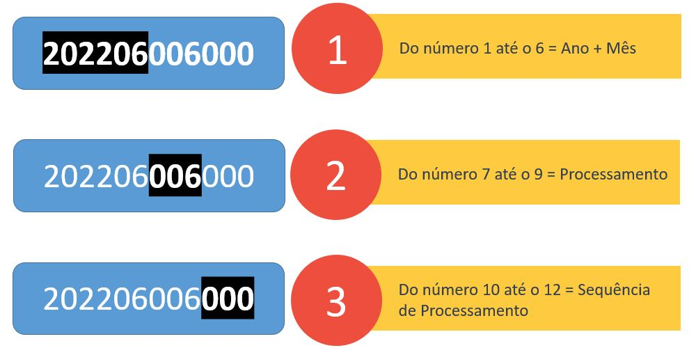
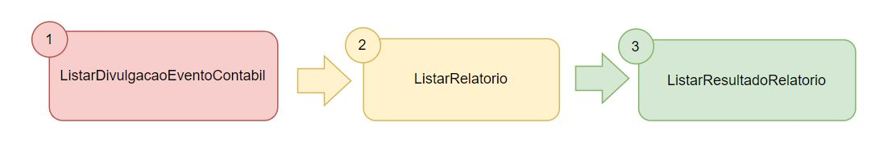
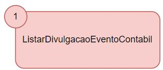
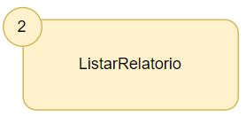
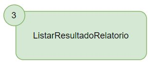

# GUIA RELATÓRIOS - Consulta de Relatórios da DRI através da Plataforma de Integração
Ao realizar a integração entre sua aplicação e a CCEE através da Plataforma de Integração, o agente pode:

- Listar o resultado do relatório desejado.

## O que fazer para consultar os relatórios da DRI disponibilizados pela Plataforma de Integração?

## Antes de tudo o que é um evento contábil ?

Um evento contábil é um código que representa a rodada do cálculo do motor da CCEE (Definição melhorada com o Lassi/Gedra). Ele é composto na sua primeira parte pelo Ano/Mês, números de 1 a 6, depois pelo processamento, números de 7 a 9, e depois pela sequência de processamento, números de 10 a 12, vide exemplo acima.

### Siga a seguinte ordem para a chamada de serviços:

 
Para extrair as informações dos relatórios da DRI disponibilizados através da Plataforma de Integração da CCEE, deve-se seguir esta ordem de chamada dos serviços, primeiro para identificar qual o evento contábil divulgado ao público tem-se interesse através do uso do primeiro serviço. Chamando o segundo serviço, deve-se encontrar o relatório desejado e os parâmetros de busca do mesmo. Por fim, ao chamar o terceiro serviço, ele retornará o resultado do relatório escolhido, quadro a quadro.

--- 
 
### Liste os eventos contábeis divulgados pela CCEE

Utilize o serviço *ListarDivulgacaoEventoContabil* para consultar os eventos contábeis que foram disponibilizados pela CCEE através da Plataforma de Integração.

[Clique aqui](https://documenter.getpostman.com/view/12351215/UzJJucpF#87f02261-4a72-47bf-b1c7-db79bb3bdcab) para ver exemplos de consulta utilizando a ferramenta Postman em seu navegador.
    
Os campos de entrada e saída do serviço podem ser consultados no [manual de utilização](https://www.ccee.org.br/documents/80415/919484/ListarDivulgacaoEventoContabilV2.pdf/e7b35bc2-7b39-f543-0972-ab9af0db9621) desse serviço. 

> Clique no botão abaixo e abra a configuração direto no Postman instalado em seu computador com os serviços da Plataforma de Integração, incluindo o Listar Divulgação Evento Contábil
>
> 

---

### Liste os acrônimos disponibilizados pela CCEE

Utilize o serviço *ListarRelatorio* para consultar os relatórios da DRI disponíveis através da Plataforma de Integração da CCEE.

[Clique aqui](https://documenter.getpostman.com/view/12351215/UzJJucpF#dc18ab94-7725-40cb-9c35-5b7cbf6c868e) para ver exemplos de consulta utilizando a ferramenta Postman em seu navegador.
    
Os campos de entrada e saída do serviço podem ser consultados no [manual de utilização](https://www.ccee.org.br/documents/80415/919484/ListarRelatorioBSv2.pdf/f9d48cfb-6a94-8a3f-93db-0673d628ae7b) desse serviço. 

> Clique no botão abaixo e abra a configuração direto no Postman instalado em seu computador com os serviços da Plataforma de Integração, incluindo o Listar Relatório
>
> 

---

### Liste os eventos contábeis divulgados pela CCEE

Utilize o serviço *ListarResultadoRelatorio* para consultar os valores ou resultados dos relatórios da DRI disponíveis através da Plataforma de Integração da CCEE.

[Clique aqui](https://documenter.getpostman.com/view/12351215/UzJJucpF#be3e3d33-3cd5-424d-a004-ef52ac23b726) para ver exemplos de consulta utilizando a ferramenta Postman em seu navegador.
    
Os campos de entrada e saída do serviço podem ser consultados no [manual de utilização](https://www.ccee.org.br/documents/80415/919484/ListarResultadoRelatorioBSv2.pdf/0691a417-52b0-d19e-2048-2fa9a8812dbe) desse serviço. 

> Clique no botão abaixo e abra a configuração direto no Postman instalado em seu computador com os serviços da Plataforma de Integração, incluindo o Listar Resultado Relatório
>
> 

